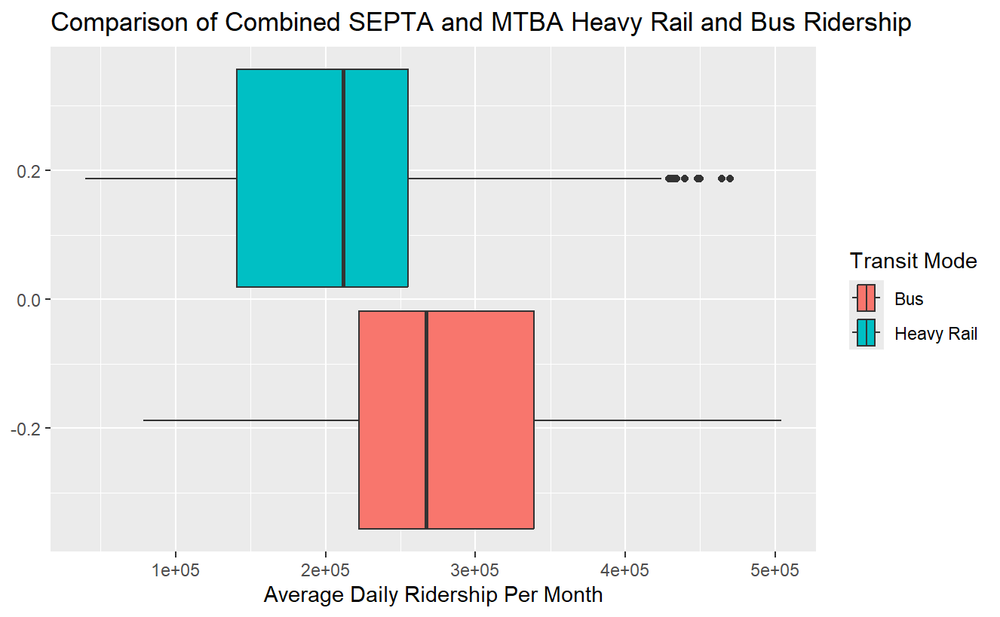
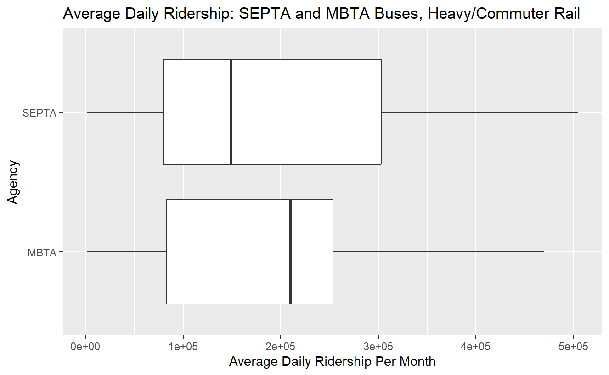

# Motivation
  I chose to study urban public transportation systems because I have used public transit for much of my life and I like that they make it possible to travel long distances without a car. Initially, I set out to compare the ridership by mode of travel of various major transportation systems in the U.S. I wanted to understand what traits of public transportation systems corralate with to high ridership.
# Data Gathering
  I accessed data on the theme that I was studying by using the open data portals maintained by public transit agencies (MBTA data portal: https://mbta-massdot.opendata.arcgis.com/, SEPTA data portal: https://wwww.septa.org/open-data/). I downloaded .csv files that documented ridership over time grouped by mode of travel from SEPTA, MBTA, CTA, and MTA to explore how I could combine data from the different agencies. Immediately, it became clear that this would be challenging. MTA and CTA separated each mode of travel into its own column while SEPTA and MBTA had a column dedicated to labeling each row by its mode of transportation. Additionally, the MBTA and SEPTA recorded daily averages within each month (written differentl,y) and CTA and MTA had daily totals. 
# Initial Data Processing
  I started by combining the SEPTA data and the MBTA data. In R Studio, I filtered out the weekday and weekend averages from the MBTA data set, so that I was left with only the rows with the daily average for all days in a given month. After that, I used the "filter" command to only keep rows the aggregated totals of a mode of travel rather than the total and average ridership of specific routes. I used the same command to keep only transit modes that not had an equivilent in the SEPTA data. Later, I removed the modes that were unique to the SEPTA data with the same method. I exported the spreadsheet from R Studio and opened it in Excel. In that program, I separated the "month_of_service" column into year and month columns using the "LEFT" and "RIGHT" functions to isolate the desired numbers from the string. 
  
  With the prior steps completed, I had enough equivilent columns in the two datasets to combine them. I copy and pasted the contents of the year, month, "route_or_line" and "ridership_average" columns from the MBTA data set into each one's counterpart column in the SEPTA data, underneath what was already there. Back in R Studio, I used the "mutate" and "case_when" commands to make a new column that converted the names that each agency used for modes of transit into a uniform set of categories. For example, SEPTA's "Regional Rail" and MBTA's "Commuter Rail" both became "Commuter Rail" in the new column. 
  
  Following these processes, I decided to limit my dataset to these two agencies. Wrestling different standards of data collection to match what I had already done seemed like more of a challenge than I wanted. Additionally, I have the most personal experience with SEPTA and MBTA, so they carried greater meaning for me than the other systems.
## Later Data Processing
  In order to create time series plots, I realized that I needed a way to put the dates of each set of rows in a form that R would recognize how to put in order. To do this, I made a new column in Excel, in which I wrote an expression to add the month divided by 12 to the year: [date value] = [year] + ([month]/12). This yielded decimal values after the digits of the year that increased in succession with each month (thanks, Professor DeFord for this idea!). 
# Visualizations
  I made a number of plots for exploratory data analysis. The following visualizations were the the ones that I found the most informative or interesting.

This graph compares the daily average ridership of different types of public transit run by SEPTA in the Philadelphia metropolitan area and MBTA in the Boston metropolitan area. Each obesrvation corresponds to the average ridership in a month. Here we can tell that SEPTA's bus ridership surpasses that of the MBTA and far outstrips the heavy rail averages in its own system. MBTA's Heavy Rail tends to carry more riders than SEPTA's and a similar amount as the MBTA busses. MBTA heavy rail also has high variance, with noticable clusters of high and low outliers. In short, MBTA relies evenly on rail and busses, while SEPTA uses far more busses than rail. Commuter rail carries the least passengers in both systems. 

This plot shows the change in monthly ridership on MBTA services between 2019 and 2025, split between heavy rail, bus, and commuter rail. This explains the high variance that I noted in the plot above. Heavy rail used to have significantly more riders than the bus (that accounts for the high outliers), but following pandemic disruptions (which are very evident here) the two had similar numbers of riders. I assume that the low outliers from the earlier plot are data from the lockdown.
# Analysis
I used a logistic regression model to understand whether average daily ridership can predict whether the transit mode of a given row is rail or bus. I chose to leave out the commuter rail averages from the rail category, since they have a low ridership for reasons other than being rail-based transit (that is, the schedule is geared towards long distance commutes). Heavy rail (which in the case of these datasets appears to refer to subway lines) seemed like a fairer comparison with busses since they are intended to enable many short or moderate-distance trips. Therefore, before doing this analysis I used the "filter" command to keep only the rows in the heavy rail and bus categories. 

A pair of boxplots compring the ridership of these two modes, combining the averages from SEPTA and MBTA shows that bus ridership tends to be higher. However, there is overlap.

After fitting a logistic regression model to the data, I compared the model's fitted values to the actual mode of transportion in the dataset. The model correctly predicted 67% of them. This indicates that there is a distinction between how many people tend to use bus and heavy rail ridership, with more using busses than heavy rail. However, ridership is far from a perfect predictor of these categories. Adding average ridership data from other transportation networks could indicate how widespread this trend is.

# Conclusion
Rather than indicating what traits of public transportation systems lead to higher ridership, analyzing this dataset has shown me transit networks can use different mixes of transit modes and return similar ridership numbers. MTBA riders more frequently take trains than SEPTA riders, but the averages for each system are similar. See the plot below:

MBTA may have a higher mean, but there is a lot of overlap. Likely, the modes of public transportation that work in one region are different from those that work elsewhere, based on what infrastructure already exists among other things. Therefore, finding what traits yield higher ridership requires taking into account many more variables regarding the transit agency, where they operate, and who their riders are, which is far more information than I gathered in my dataset. 

